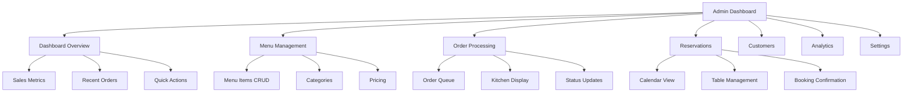
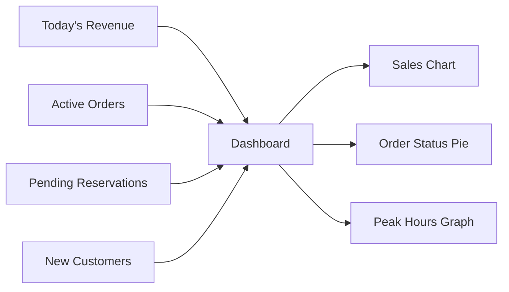
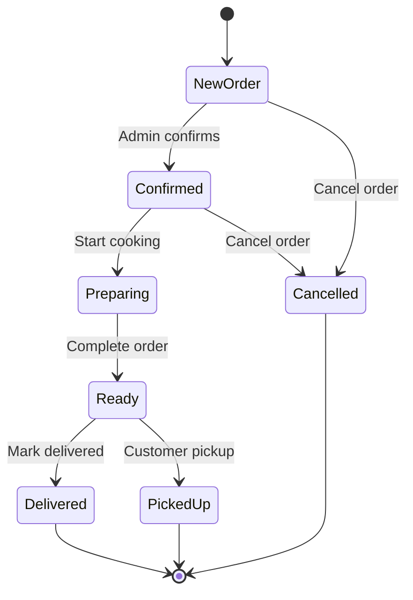
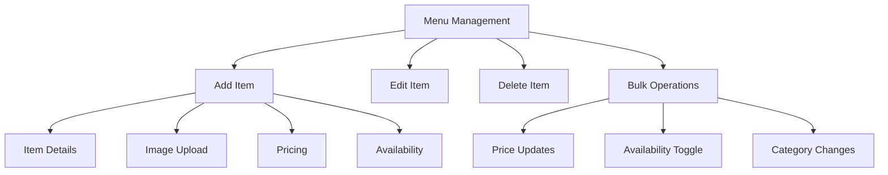

# Restaurant Admin Dashboard

## 🏗️ Admin Architecture

## 🎛️ Dashboard Components

### Overview Dashboard

### Order Management Flow

### Menu Management

## Key Admin Features
- **Real-time Dashboard**: Live metrics and order updates
- **Order Processing**: Kitchen display and status management
- **Menu Management**: Complete CRUD for menu items
- **Reservation Calendar**: Table booking management
- **Customer Analytics**: Insights and behavior tracking
- **Sales Reports**: Revenue and performance analysis
- **Settings**: Restaurant configuration and preferences