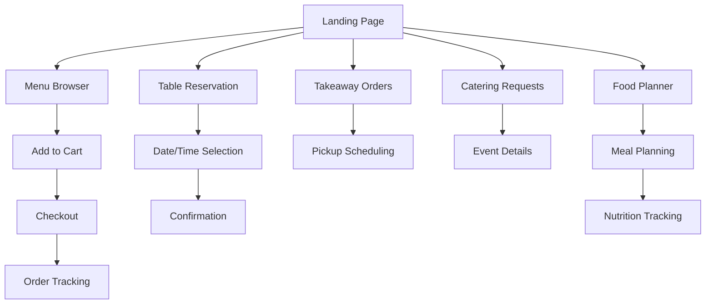
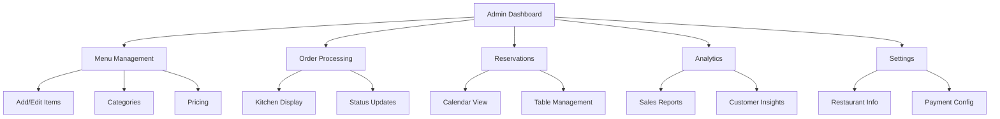
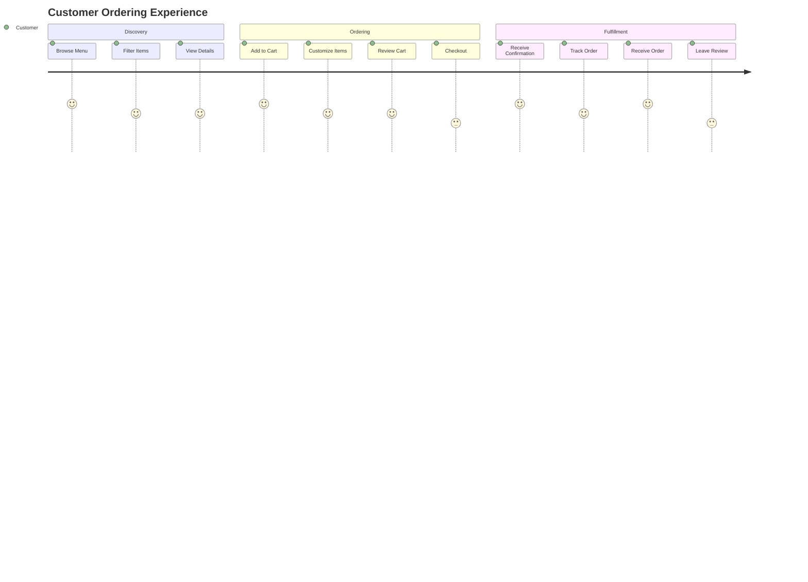

# Restaurant Features Overview

## 🍽️ Customer Features

## 👨‍💼 Admin Features

## 🔄 User Journey

## Key Features
- **Online Ordering**: Full e-commerce cart with customization
- **Table Reservations**: Real-time availability checking
- **Takeaway**: Scheduled pickup with time slots
- **Catering**: Event planning and custom quotes
- **Food Planner**: Meal planning with nutrition data
- **Admin Dashboard**: Complete restaurant management
- **Analytics**: Sales, customers, and performance insights