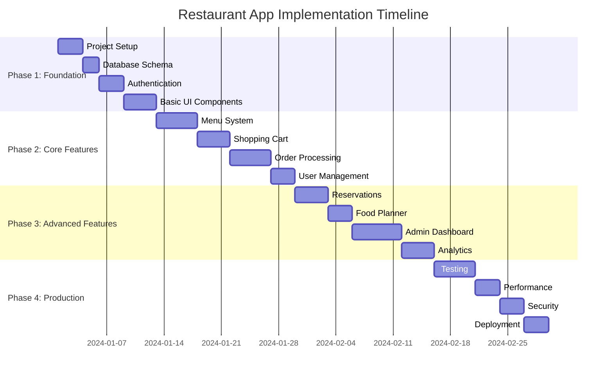
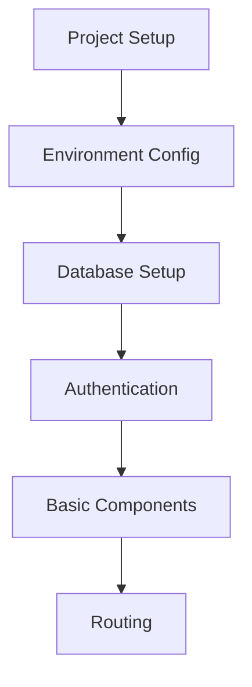
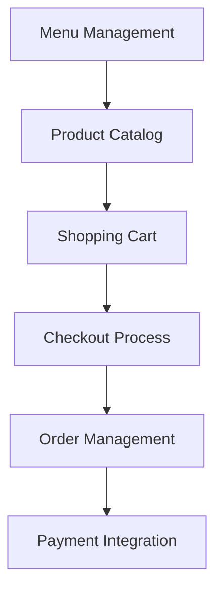
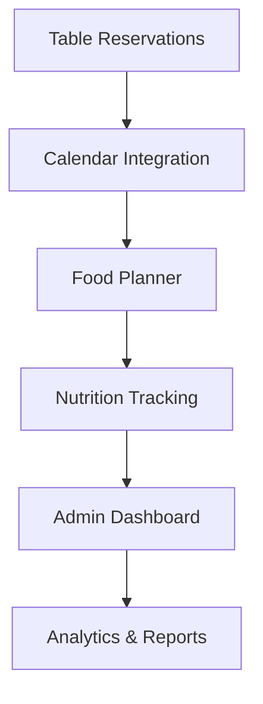
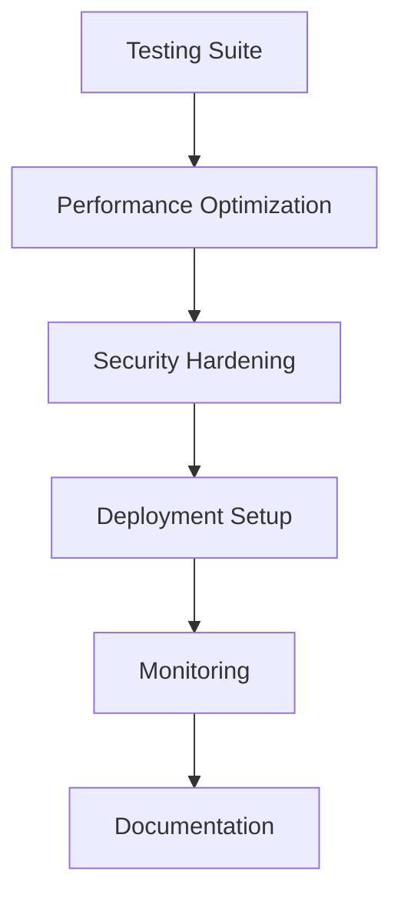

# Restaurant Implementation Guide

## 🚀 Implementation Phases



## 📋 Phase Breakdown

### Phase 1: Foundation (2 weeks)


**Key Deliverables:**
- Project structure and dependencies
- PostgreSQL database with Prisma
- Clerk authentication integration
- Base UI components library
- Client-side routing setup

### Phase 2: Core Features (3 weeks)


**Key Deliverables:**
- Dynamic menu display
- Cart functionality with persistence
- Order placement and tracking
- Stripe payment integration
- Basic admin order management

### Phase 3: Advanced Features (3 weeks)


**Key Deliverables:**
- Reservation booking system
- Meal planning functionality
- Comprehensive admin interface
- Sales and customer analytics
- Real-time notifications

### Phase 4: Production Ready (2 weeks)


**Key Deliverables:**
- Comprehensive test coverage
- Performance optimizations
- Security audit and fixes
- Production deployment
- User documentation

## 🛠️ Development Setup

### Prerequisites
- Node.js 18+
- Python 3.11+
- Docker & Docker Compose
- Git

### Quick Start Commands
```bash
# Clone repository
git clone <repo-url>
cd restaurant-app

# Install dependencies
pnpm install

# Setup environment
cp .env.example .env
cp apps/landing/.env.example apps/landing/.env.local
cp apps/web/.env.example apps/web/.env.local
cp apps/backend/.env.example apps/backend/.env

# Start database
docker-compose up -d postgres

# Run migrations
cd apps/backend
npx prisma migrate dev

# Start development
pnpm dev
```

## 📊 Success Metrics

- **Performance**: Page load < 2s, API response < 200ms
- **Testing**: >90% code coverage, all E2E tests passing
- **Security**: No critical vulnerabilities, HTTPS enforced
- **UX**: Mobile-first design, accessibility compliant
- **Scalability**: Support 1000+ concurrent users