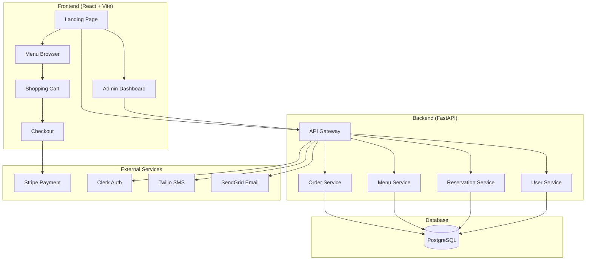
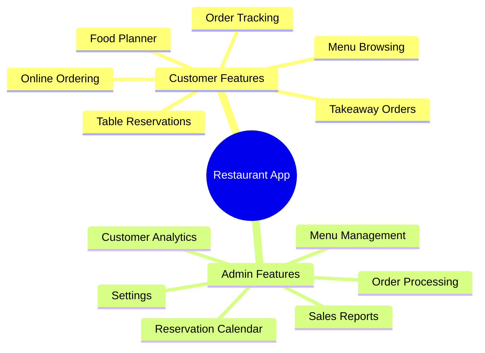
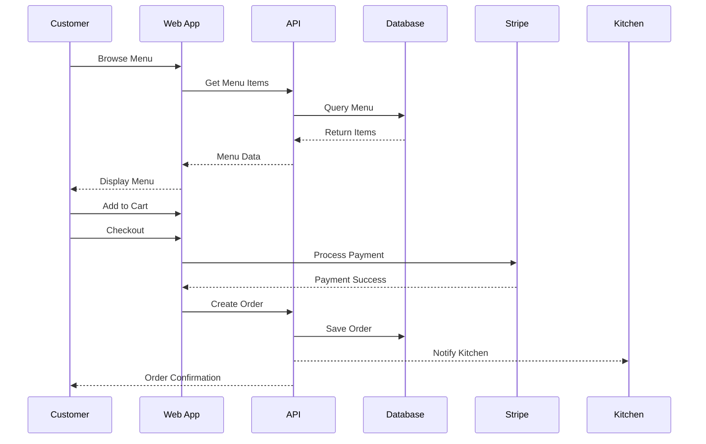
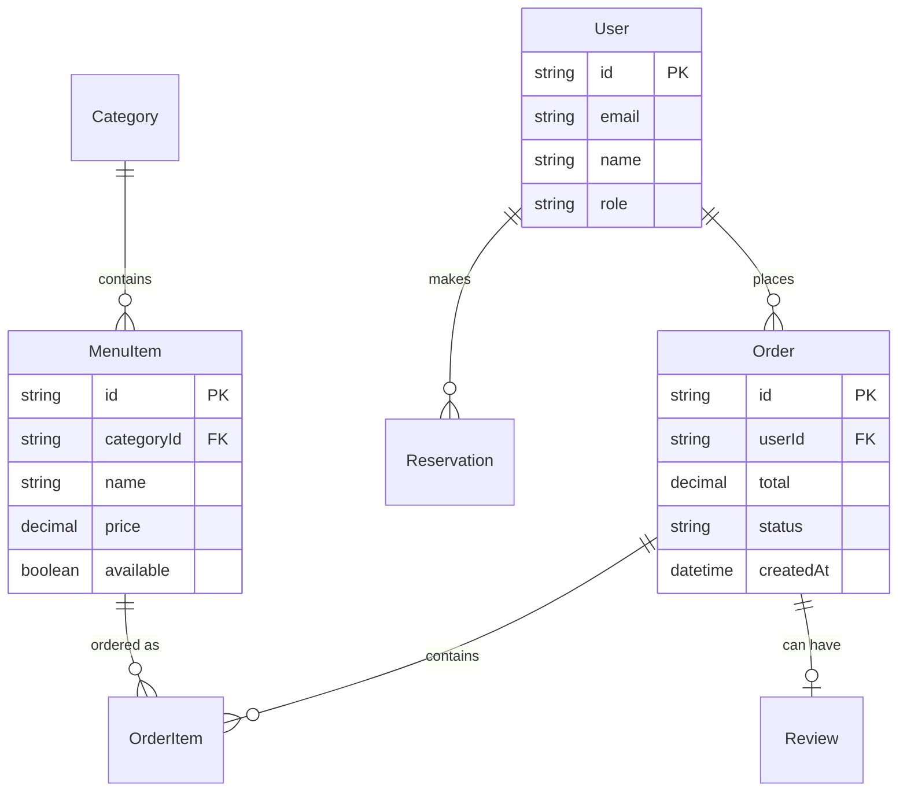
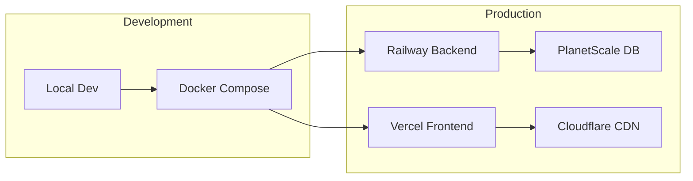

# Restaurant App - Project Overview

## 🏗️ System Architecture

## 🍽️ Core Features

## 🔄 Order Flow

## 🗄️ Data Model

## 🚀 Deployment

## Tech Stack
- **Frontend**: React 18, Vite, Tailwind, shadcn/ui
- **Backend**: FastAPI, Prisma, PostgreSQL
- **Auth**: Clerk
- **Payments**: Stripe
- **Notifications**: Twilio (SMS), SendGrid (Email)