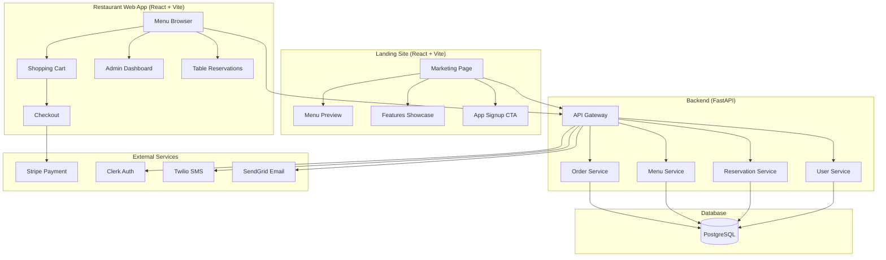
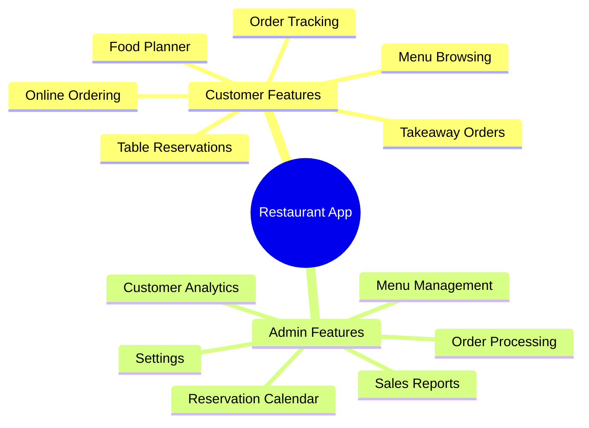
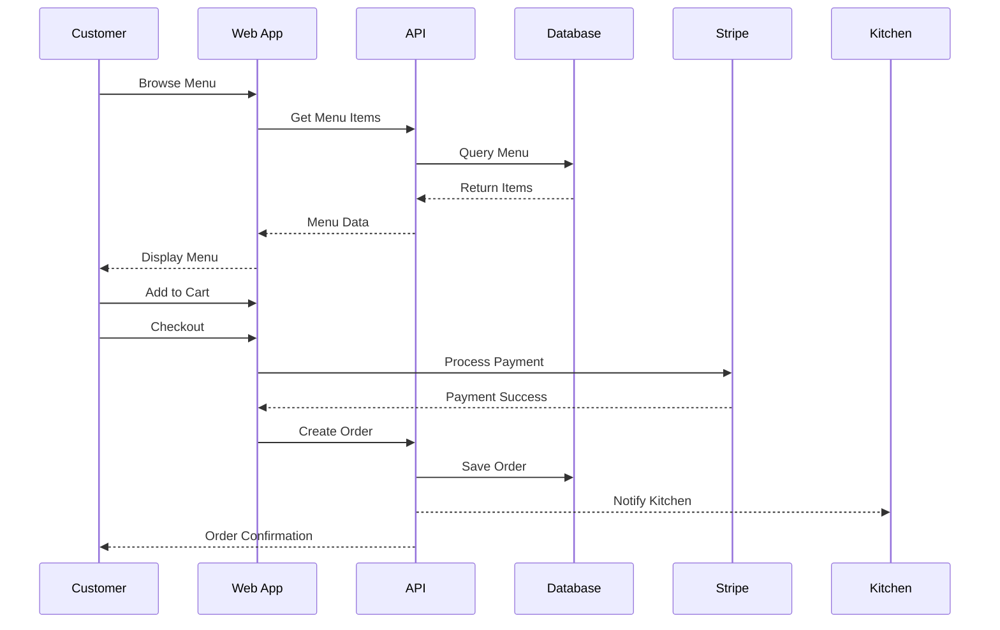
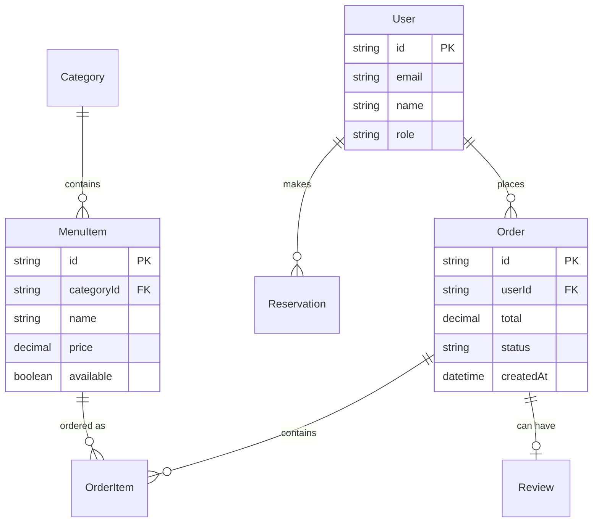
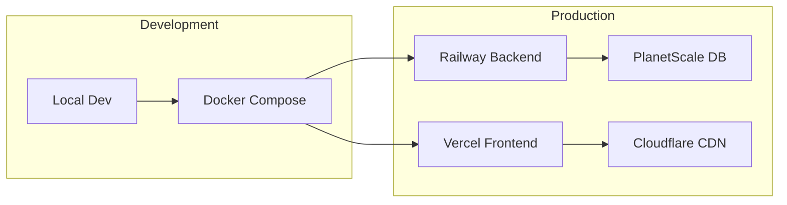

# Restaurant App - Project Overview

## 🏗️ System Architecture

## 🍽️ Core Features

## 🔄 Order Flow

## 🗄️ Data Model

## 🚀 Deployment

## Tech Stack
- **Landing Site**: React 18, Vite, Tailwind (apps/landing/)
- **Restaurant App**: React 18, Vite, Tailwind, shadcn/ui (apps/web/)
- **Backend**: FastAPI, Prisma, PostgreSQL (apps/backend/)
- **Auth**: Clerk
- **Payments**: Stripe
- **Notifications**: Twilio (SMS), SendGrid (Email)