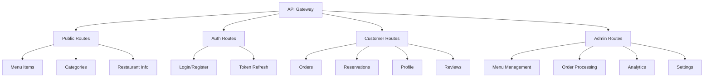
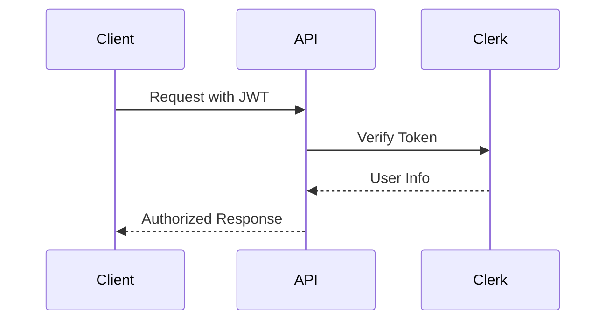
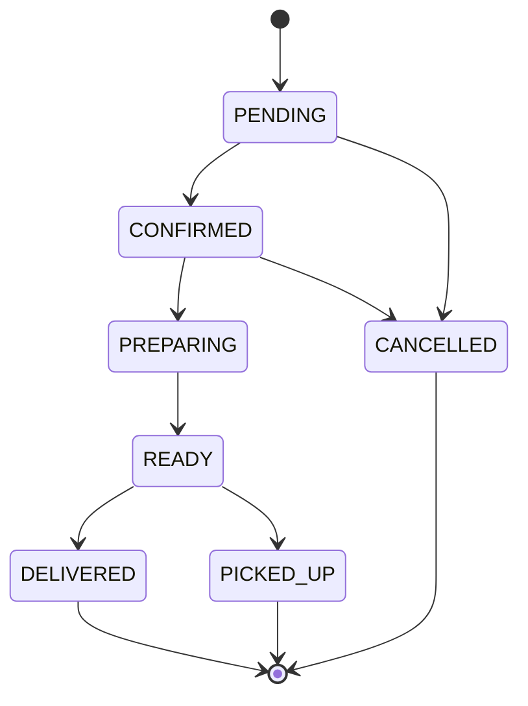

# Restaurant API Documentation

## 🌐 API Structure



## 🔒 Authentication



## 📍 Key Endpoints

### Public Routes
- `GET /menu` - Get menu items
- `GET /categories` - Get categories
- `GET /restaurant/info` - Restaurant details

### Customer Routes
- `POST /orders` - Place order
- `GET /orders` - Order history
- `POST /reservations` - Book table
- `GET /reservations` - View bookings

### Admin Routes
- `POST /admin/menu-items` - Add menu item
- `PUT /admin/orders/{id}/status` - Update order status
- `GET /admin/analytics` - Sales data
- `PUT /admin/settings` - Update settings

## 🔄 Order Status Flow



## Response Format
```json
{
  "success": true,
  "data": {},
  "message": "Operation completed",
  "timestamp": "2024-01-01T00:00:00Z"
}
```