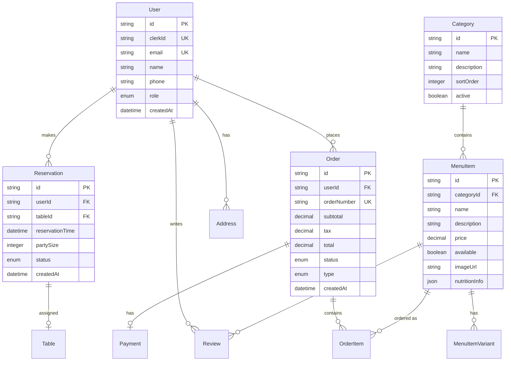

# Restaurant Database Schema

## 🗄️ Database Structure

## 🔑 Key Tables

### Core Entities
- **User**: Customer & admin accounts (Clerk integration)
- **Order**: Food orders with status tracking
- **MenuItem**: Menu catalog with variants
- **Category**: Menu organization
- **Reservation**: Table booking system

### Supporting Tables
- **OrderItem**: Individual order line items
- **Payment**: Payment processing records
- **Address**: Customer delivery addresses
- **Review**: Customer feedback system
- **Table**: Restaurant table management

## 📈 Relationships
- One user can have many orders and reservations
- Orders contain multiple order items
- Menu items belong to categories
- Reservations are assigned to tables
- Users can review menu items