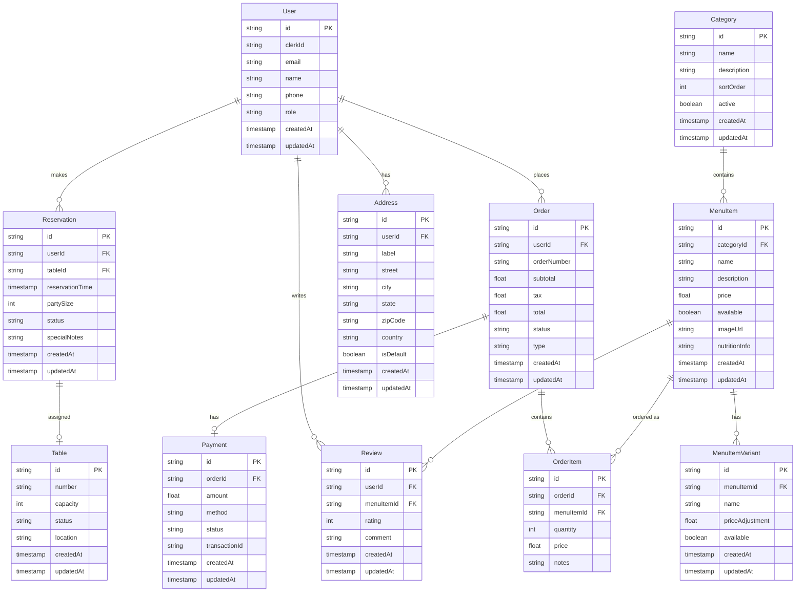

# Restaurant Database Schema

## 🗄️ Database Structure

## 🔑 Key Tables

### Core Entities
- **User**: Customer & admin accounts (Clerk integration)
- **Order**: Food orders with status tracking
- **MenuItem**: Menu catalog with variants
- **Category**: Menu organization
- **Reservation**: Table booking system

### Supporting Tables
- **OrderItem**: Individual order line items
- **MenuItemVariant**: Size/customization options for menu items
- **Payment**: Payment processing records
- **Address**: Customer delivery addresses
- **Review**: Customer feedback system
- **Table**: Restaurant table management

## 📊 Enumerations

### User Roles
- `CUSTOMER` - Regular customer
- `ADMIN` - Restaurant administrator
- `STAFF` - Restaurant staff

### Order Status
- `PENDING` - Order placed, awaiting confirmation
- `CONFIRMED` - Order accepted by restaurant
- `PREPARING` - Order being prepared
- `READY` - Order ready for pickup/delivery
- `DELIVERED` - Order delivered to customer
- `CANCELLED` - Order cancelled

### Order Type
- `DELIVERY` - Home delivery
- `PICKUP` - Customer pickup
- `DINE_IN` - Dine in restaurant

### Reservation Status
- `PENDING` - Awaiting confirmation
- `CONFIRMED` - Reservation confirmed
- `SEATED` - Customer seated
- `COMPLETED` - Reservation completed
- `CANCELLED` - Reservation cancelled

### Payment Method
- `CREDIT_CARD` - Credit card payment
- `DEBIT_CARD` - Debit card payment
- `CASH` - Cash payment
- `DIGITAL_WALLET` - Digital wallet (Apple Pay, Google Pay, etc.)

### Payment Status
- `PENDING` - Payment pending
- `COMPLETED` - Payment successful
- `FAILED` - Payment failed
- `REFUNDED` - Payment refunded

### Table Status
- `AVAILABLE` - Table available
- `OCCUPIED` - Table occupied
- `RESERVED` - Table reserved
- `MAINTENANCE` - Table under maintenance

## 📈 Relationships
- One user can have many orders, reservations, reviews, and addresses
- Orders contain multiple order items and one payment
- Menu items belong to categories and can have variants
- Menu items can receive multiple reviews
- Reservations are assigned to tables
- Each order item references a menu item
- Payments are linked to orders (one-to-one)

## 🔐 Key Constraints
- User email and clerkId must be unique
- Order number must be unique
- Table number must be unique
- Payment orderId is unique (one payment per order)
- All monetary values use decimal precision (10,2)
- Timestamps automatically managed (createdAt, updatedAt)

## 💾 Database Configuration
- **Database**: PostgreSQL
- **ORM**: Prisma
- **Connection**: Port 5488 (development)
- **Decimal Precision**: Enabled for monetary values