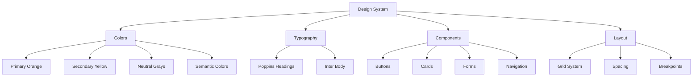
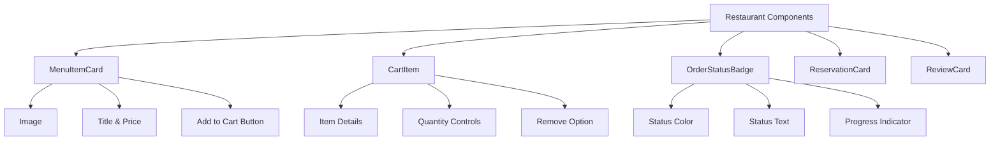

# Restaurant UI Components

## 🎨 Design System



## 🎯 Core Components

### Button Component
```tsx
interface ButtonProps {
  variant: 'primary' | 'secondary' | 'outline' | 'ghost'
  size: 'sm' | 'md' | 'lg'
  children: React.ReactNode
}
```

### Card Component
```tsx
interface CardProps {
  variant: 'default' | 'elevated' | 'outlined'
  padding: 'sm' | 'md' | 'lg'
  children: React.ReactNode
}
```

## 🍽️ Restaurant-Specific Components



## Color Palette
- **Primary**: #f97316 (Orange)
- **Secondary**: #eab308 (Yellow)
- **Success**: #10b981 (Green)
- **Warning**: #f59e0b (Amber)
- **Error**: #ef4444 (Red)

## Typography
- **Headings**: Poppins (Bold)
- **Body**: Inter (Regular/Medium)
- **Scale**: 12px - 48px with 1.5 line height